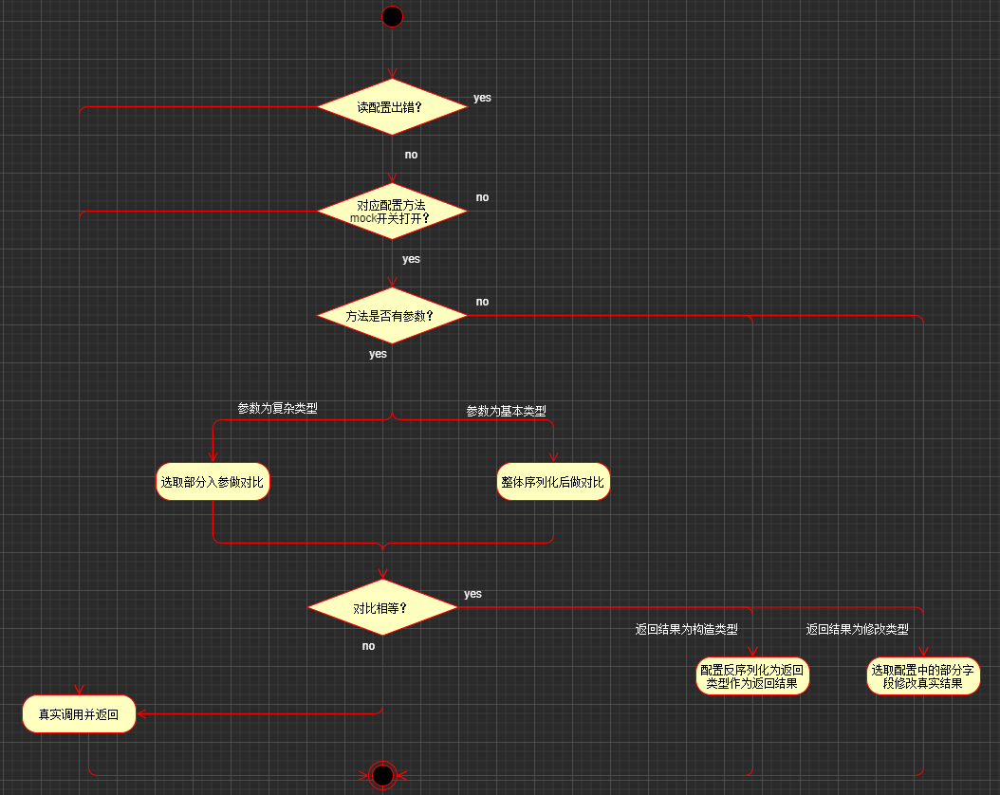

# java-method-mock
## 背景

在生产上线时，可能遇到有一些case不好立即验证；

- 例如用户必须是xx用户（新用户，流失用户...）才能领到某些活动券，而这样的用户账号不好获取；
- 例如想让测试用户看到不同的页面效果；

所以希望在调用一些方法接口的时候针对指定入参可以返回指定的返回结果。

这些方法可以是调用上游的dubbo方法，也可以是内部自己的本地方法等。

## 方案设计

### 入参出参分析

首先来看方法的参数和返回结果的类型，以及入参和出参组装分类；

#### 入参出参数据类型分类

- 基本类型或者包装类型：int, double, Integer，String，Boolean...
- 集合类型：List<T>，Map<K, V>...
- 复杂类型：xxxRequest，xxxResponse

#### 入参出参组装分类

入参：

- 无入参

  public int fun();

- 一个入参（可能是三种类型的其中一种）

  - public int fun(String s);

  - public int fun(List<Integer> list);
  - public int fun(xxxRequest request);

- 多个入参（可能是三种类型都有）

  - public int fun(String s, List<Integer> list, xxxRequest request);

出参：

- 一个出参（可能是三种类型的其中一种）

  - public Integer fun();

  - public List<Integer> fun();

  - public xxxResponse fun();

- 无出参（不考虑）

### mock配置方式

针对上面对方法入参和出参的分析，可以确定我们需要实现mock的场景和配置方式。

入参：match配置内容则返回mock结果

1. 方法没有入参，无需配置对比；

2. 方法入参类型为基本类型或集合类型（Integer，List<String>）；序列化后整体做对比

3. 方法入参类型为复杂类型（xxxRequest）；可选取部分字段对比

   **需要注意List<xxxRequest>也需要序列化后整体做对比**

出参：

1. 想要构造整个出参的结果；

2. 想要从真实调用中修改结果的某几个字段的值；

   其中有些字段嵌套的比较深，可利用"a.b.c"的配置方式来修改，可参考下文的配置；

### mock流程



从流程上可以看出，为了不影响到接口调用，流程中做了严格的校验处理，一旦报错或者配置信息有误都要真实调用并返回结果。

## 代码实现 

完整代码见github：https://github.com/XDcherish/java-method-mock/tree/main

### 1.引入切面与注解

引入切面：

```
@Bean
public MethodMockAspect methodMockAspect() {
    return new MethodMockAspect();
}
```

切面的扫描范围是添加了@MethodMock的类，这样类中的方法在调用过程中会被切面拦截 。

```java
@MethodMock
public class TestMockClass {

    public Boolean testSimpleWithoutInput() {
        System.out.println("真实执行啦:");
        return true;
    }
}
```

### 2.增加mock配置

可参考com.xh.utils.mock.dto.MethodMockDTO中的注释进行配置，各字段有详细解释；

mockRequestDTOsList和mockResponseDTOS 都是List表示支持同一个方法的多组入参和出参匹配。

例如下面的配置：

```json
{
"com.xh.utils.mock.test.TestMockClass#testSimpleWithoutInput": {	//简单无入参的配置
    "openMock": true,	//是否开启配置
    "mockResponseDTOS": [	//只需要配置response即可，虽然是数组，但只能配置一个
      {
        "mockType": 1,	//"mockType" 为1表示自己构造返回，不填默认为修改类型的出参，效果和"mockType": 0一致
        "responseContent": false
      }
    ]
  },
  "com.xh.utils.mock.test.TestMockClass#testSimpleInputOutput": {
    "openMock": true,
    "mockRequestDTOsList": [	//数组下标为1的入参配置对应下标为1的出参配置
      [
        {
          "requestType": 1,	//requestType为1表示基本类型或者集合类型的入参，requestType不填默认为复杂类型的入参，效果和requestType为0一致
          "requestCompareContent": "mock"
        }
      ]
    ],
    "mockResponseDTOS": [
      {
        "mockType": 1,
        "responseContent": true
      }
    ]
  },
  "com.xh.utils.mock.test.TestMockClass#testComplexInputOutput": {	//复杂类型的配置
    "openMock": true,
    "mockRequestDTOsList": [
      [
        {
          "requestType": 1,
          "requestCompareContent": "1"
        },
        {
          "requestCompareContent": {	//选择其中的id和inputDTO两个字段进行对比即可
            "id": 1,
            "inputDTO":{
              "subId": 101
            }
          }
        }
      ],
      [
        {
          "requestType": 1,
          "requestCompareContent": "2"
        },
        {
          "requestCompareContent": {	
            "id": 2,
            "inputDTO": {
              "subId": 201
            }
          }
        }
      ]
    ],
    "mockResponseDTOS": [
      {
        "responseContent": {	//只想修改真实返回结果中的resName 和 outputDTOS
          "resName": "modifyName",
          "outputDTOS": "[{\"resSubId\":21},{\"resSubId\":22}]",
          "outputDTO.resSubName": "修改嵌套较深的字段"
        }
      },
      {
        "mockType": 1,
        "responseContent": {	//构造整体的返回结果
          "resId": 1,
          "resName": "mockName",
          "outputDTOS": [	
            {
              "resSubId": 11
            },
            {
              "resSubId": 12
            }
          ]
        }
      }
    ]
  }
}
```

下文会有单测进行补充说明

### 3.解析mock配置

解析配置内容可灵活实现，这里为了方便直接在项目的resources目录下存放config.json，然后直接解析如下代码，实际上可以用一些配置框架实现线上和测试环境配置不同，实时切换，例如接入携程开源的appllo（分布式配置中心）。

```java
//解析config.json的代码
private Map<String, MethodMockDTO> getConfigContent() throws IOException {
        String path = "/config.json";
        InputStream config = MethodMockAspect.class.getResourceAsStream(path);
        if (config != null) {
            Map<String, MethodMockDTO> configMap = objectMapper.readValue(config, new TypeReference<Map<String, MethodMockDTO>>() {});
            System.out.println(JsonUtils.toJson(configMap));
            return configMap;
        }
        return null;
    }
```

### 4.代码测试

com.xh.utils.mock.test.TestMockClass 中给了几个方法并写了单测；

```java
@Service
@MethodMock
public class TestMockClass {

    public Boolean testSimpleWithoutInput() {
        System.out.println("真实执行啦:");
        return true;
    }

    public Boolean testSimpleInputOutput(String input) {
        System.out.println("真实执行啦:" + input);
        return false;
    }

    public MockTestResponse testComplexInputOutput(String requestFirst, MockTestRequest requestSecond) {
        MockTestResponse response = new MockTestResponse();
        response.setResId(9L);
        response.setResName("真实调用");
        response.setOutputDTOS(new ArrayList<>());
        MockTestOutputDTO outputDTO = new MockTestOutputDTO();
        outputDTO.setResSubId(901L);
        outputDTO.setResSubName("真实调用subName");
        response.setOutputDTO(outputDTO);
        System.out.println("真实执行啦:" + JsonUtils.toJson(response));
        return response;
    }

}
```

单测内容：

```java
@SpringBootTest
class MockApplicationTests {

    @Autowired
    private TestMockClass mockClass;

    @Test
    void testSimpleInputOutput() {
        System.out.println(mockClass.testSimpleInputOutput("mock"));
    }

    @Test
    void testSimpleWithoutInput() {
        System.out.println(mockClass.testSimpleWithoutInput());
    }

    @Test
    void testComplexInputOutput() {
        //  mockClass.testSimpleInputOutput("mock");
        //  mockClass.testSimpleWithoutInput();
        MockTestRequest request = new MockTestRequest();
        request.setId(1L);
        MockTestInputDTO inputDTO = new MockTestInputDTO();
        inputDTO.setSubId(101L);
        request.setInputDTO(inputDTO);
        MockTestResponse response = mockClass.testComplexInputOutput("1", request);
        System.out.println("最后的结果:" + JsonUtils.toJson(response));
    }
}
```

- 对于testSimpleWithoutInput()，根据配置可看到固定返回mock的结果false不会走到具体方法中去。
- 对于testSimpleInputOutput(String input)，根据配置可看到当输入内容是"mock"时，会返回true。
- 对于testComplexInputOutput(String requestFirst, MockTestRequest requestSecond)，根据配置可知有两组配置结果，以第一组为例，当requestFirst等于"1"，requestSecond中选择id 和 inputDTO进行对比，当id等于1L，inputDTO序列化结果为{"subId": 101} 时，会真实调用方法，然后取到结果将resName修改为"modifyName"，outputDTOS修改为"[{\"resSubId\":21},{\"resSubId\":22}]"， outputDTO的resSubName字段修改为"修改嵌套较深的字段"。

## 总结

本文并没有对代码实现进行详细的说明，因为其实并不复杂，暂时也没有时间。其中构造返回结果的时候有遇到一些泛型擦除的问题，后续可以补充一下，可能也会有一些地方存在一些bug没被发现，希望发现bug的同学能评论下，万分感激。还有就是其实可以支持更复杂的mock场景，如果读者觉得有必要也可以自行进行扩展，后续如果有必要也会再对文章进行补充。

----

博客链接：https://juejin.cn/post/6989250087603929102